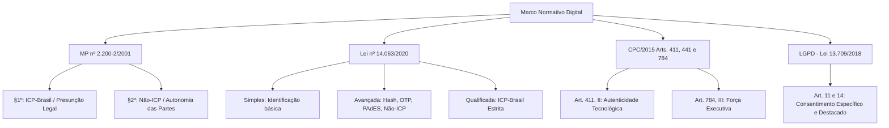

# PARECER TÉCNICO-JURÍDICO E ARTIGO DOGMÁTICO
**Conforme as Normas da ABNT (NBR 6022:2018, NBR 6023:2018 e NBR 10520:2023)**

---

# VALIDADE JURÍDICA DAS ASSINATURAS ELETRÔNICAS NO DIREITO BRASILEIRO: DA TAXONOMIA DA LEI Nº 14.063/2020 À CONSOLIDAÇÃO JURISPRUDENCIAL DO STJ (REsp 2.205.708/PR)

---

### **RESUMO**
O presente trabalho analisa a validade, a eficácia probatória e a executividade das assinaturas eletrônicas no ordenamento jurídico brasileiro, com foco na interpretação harmônica entre a Medida Provisória nº 2.200-2/2001, a Lei nº 14.063/2020, o Código de Processo Civil (Lei nº 13.105/2015), a Lei Geral de Proteção de Dados Pessoais (Lei nº 13.709/2018) e a jurisprudência recente do Superior Tribunal de Justiça (STJ). Examina-se a taxonomia legal tripartite — assinaturas simples, avançadas e qualificadas —, desmistificando o monopólio da Infraestrutura de Chaves Públicas Brasileira (ICP-Brasil) em face do art. 10, § 2º, da MP nº 2.200-2/2001. A partir do julgamento do REsp nº 2.205.708/PR e precedentes correlatos (REsp 1.495.920/DF e REsp 1.835.077/MS), demonstra-se que as assinaturas eletrônicas avançadas e desprovidas de certificado ICP-Brasil gozam de plena validade jurídica e aptidão para constituir títulos executivos e termos de consentimento inatacáveis, desde que resguardados os vetores de autenticidade, integridade e auditabilidade por meio de trilhas forenses de evidência digital (*audit trail*).

**Palavras-chave:** Assinatura Eletrônica. Lei nº 14.063/2020. MP nº 2.200-2/2001. ICP-Brasil. STJ. REsp 2.205.708/PR. Título Executivo Extrajudicial. Segurança Jurídica. Plataforma Catraki.

---

## 1. INTRODUÇÃO E CONTEXTUALIZAÇÃO NORMATIVA

A desmaterialização dos atos jurídicos e a migração das relações contratuais e administrativas para o ambiente digital impuseram uma releitura dogmática dos institutos tradicionais do Direito Civil e do Direito Processual Civil. A manifestação de vontade, elemento nuclear do negócio jurídico (art. 107 do Código Civil), desvinculou-se do suporte físico de papel e da aposição gráfica de firma manuscrita, encontrando no meio telemático novos instrumentos de validação e perpetuação da memória documental.

No cenário brasileiro, o marco regulatório inaugural das transações eletrônicas estruturou-se com a **Medida Provisória nº 2.200-2, de 24 de agosto de 2001**, que instituiu a Infraestrutura de Chaves Públicas Brasileira (ICP-Brasil). Subsequentemente, a **Lei Federal nº 14.063, de 23 de setembro de 2020**, veio sistematizar e desburocratizar o uso das assinaturas eletrônicas nas interações com os entes públicos e consolidar uma classificação tripartite aplicável ao ambiente digital.

Durante anos, subsistiram controvérsias doutrinárias e práticas judiciais apegadas a um formalismo estrito, sob a premissa errônea de que apenas os documentos subscritos com certificados emitidos pela ICP-Brasil possuiriam validade plena ou força executiva. Contudo, a evolução jurisprudencial, culminando no julgamento do **Recurso Especial nº 2.205.708/PR pelo Superior Tribunal de Justiça (STJ)**, alinhou a hermenêutica judiciária aos princípios da autonomia privada, da boa-fé objetiva e da instrumentalidade das formas, reconhecendo a legitimidade e a plena eficácia das assinaturas eletrônicas avançadas produzidas com trilha de auditoria idônea.

---

## 2. O MARCO REGULATÓRIO BRASILEIRO

A higidez jurídica dos documentos eletrônicos assenta-se em um tripé normativo integrado:



### 2.1. A Medida Provisória nº 2.200-2/2001 e a Dupla Via de Validade
A MP nº 2.200-2/2001 estabeleceu dois regimes jurídicos distintos para a subscrição de documentos digitais, expressos nos parágrafos de seu artigo 10:

1. **Regime com Presunção Legal de Veracidade (Art. 10, § 1º):** As declarações constantes dos documentos em forma eletrônica produzidos com a utilização de processo de certificação disponibilizado pela ICP-Brasil presumem-se verdadeiras em relação aos signatários (*presunção juris tantum* de autoria e integridade).
2. **Regime Convencional / Tecnologias Alternativas (Art. 10, § 2º):** O legislador estabeleceu expressamente que o disposto na MP *não obsta a utilização de outro meio de comprovação da autoria e integridade de documentos em forma eletrônica, inclusive os que utilizem certificados não emitidos pela ICP-Brasil, desde que admitido pelas partes como válido ou aceito pela pessoa a quem for oposto o documento*.

O § 2º consagra o **princípio da não-exclusividade** da ICP-Brasil, assegurando que métodos corporativos e privados de autenticação eletrônica detêm respaldo legal direto.

### 2.2. O Código de Processo Civil (Lei nº 13.105/2015)
O CPC/2015 modernizou o regime de provas documentais:
* **Art. 411, inciso II:** Considera-se autêntico o documento quando a autoria estiver identificada por qualquer meio legal de certificação, inclusive eletrônico, nos termos da lei.
* **Art. 441:** Serão admitidos documentos eletrônicos produzidos e conservados com a observância da legislação específica.
* **Art. 784, inciso III:** A eficácia executiva do documento particular assinado pelo devedor e por testemunhas foi flexibilizada e adaptada pelo STJ para acolher a assinatura eletrônica avançada com trilha auditável, mesmo quando dispensada a assinatura física simultânea de testemunhas.

---

## 3. CLASSIFICAÇÃO TRIPARTITE DAS ASSINATURAS ELETRÔNICAS (LEI Nº 14.063/2020)

A Lei nº 14.063/2020 estabeleceu critérios objetivos de classificação, definindo os requisitos técnicos e o grau de confiabilidade de cada modalidade:

| Modalidade | Definição Legal (Art. 4º) | Tecnologias Típicas | Nível de Risco / Aplicação |
| :--- | :--- | :--- | :--- |
| **Assinatura Eletrônica Simples** | Permite identificar o signatário e anexa ou associa dados a outros dados em formato eletrônico (Art. 4º, I). | *Login* e senha simples, confirmação via e-mail sem 2FA, aceite em termos de uso (*clickwrap*), contas Gov.br nível Bronze. | Baixo risco probatório; transações cotidianas de menor impacto patrimonial. |
| **Assinatura Eletrônica Avançada** | Associada ao signatário de forma unívoca; dados sob seu controle exclusivo; vinculação que permite detectar alterações posteriores (Art. 4º, II). | Certificados corporativos/privados, criptografia assimétrica, hash SHA-256, OTP (*One-Time Password*), geolocalização, IP, biometria facial, contas Gov.br Prata/Ouro. | Médio a alto risco; contratos empresariais, termos de consentimento (TCLE/LGPD), instrumentos bancários, civis e educacionais. |
| **Assinatura Eletrônica Qualificada** | Utiliza certificado digital emitido no âmbito da ICP-Brasil, nos termos do art. 10, § 1º, da MP nº 2.200-2/2001 (Art. 4º, III). | Certificados digitais A1/A3 ICP-Brasil (e-CPF, e-CNPJ, token/smartcard). | Atos de transferência de imóveis, emissão de notas fiscais eletrônicas, atos normativos do Poder Público e hipóteses com expressa exigência legal. |

### 3.1. Requisitos Técnicos da Assinatura Avançada
Para que uma assinatura eletrônica seja enquadrada como **avançada** nos termos do art. 4º, II, da Lei nº 14.063/2020, exige-se o cumprimento cumulativo de três vetores tecnológicos:
1. **Univocidade e Identificação:** Associação unívoca ao signatário (validação de identidade por múltiplos fatores: conferência cadastral, e-mail institucional, celular com token OTP SMS/WhatsApp, documento de identidade com foto ou biometria facial).
2. **Exclusividade de Controle:** Criação da assinatura com dados que operam sob o domínio e ciência exclusiva do signatário no momento do ato.
3. **Integridade Inviolável:** Vinculação do conteúdo textual/binário por meio de funções criptográficas de resumo (*hashing* SHA-256 / padrão PAdES), garantindo que qualquer alteração posterior no documento quebre o selo de integridade e invalide a assinatura.

---

## 4. A JURISPRUDÊNCIA DO STJ: REsp 2.205.708/PR E A CONSOLIDAÇÃO DA VALIDADE FORA DA ICP-BRASIL

### 4.1. Análise Dogmática do REsp 2.205.708/PR
No julgamento do **REsp nº 2.205.708/PR**, a Terceira Turma do Superior Tribunal de Justiça, sob a relatoria da Ministra Nancy Andrighi, consolidou entendimento fundamental para o ecossistema digital brasileiro:

> **Tese Jurídica Firmada:**
> *"A assinatura eletrônica em documento particular, ainda que não certificada pela ICP-Brasil (assinatura avançada), é válida e confere executividade ao instrumento, desde que demonstrada a autenticidade e a integridade da manifestação de vontade por meio de elementos tecnológicos idôneos (como logs de auditoria, geolocalização, endereço IP e confirmações de autenticação)."*

Essa orientação jurisprudencial reafirma precedentes paradigmáticos do próprio STJ:
* **REsp 1.495.920/DF (Rel. Min. Paulo de Tarso Sanseverino):** Reconheceu a validade de contratos eletrônicos sem assinatura física de testemunhas, desde que atestada a integridade e a autenticidade pela autoridade certificadora ou plataforma digital.
* **REsp 1.835.077/MS:** Assentou que a evolução tecnológica impõe a modernização do conceito de "documento assinado", não podendo a forma sobrepor-se à manifestação inconteste de vontade das partes.

### 4.2. Fundamentos Principiológicos e Probatórios
O acolhimento dessas assinaturas fundamenta-se nos seguintes cânones:
1. **Princípio da Autonomia Privada e Pacta Sunt Servanda:** As partes são livres para eleger o método pelo qual manifestam sua anuência e constituem obrigações (art. 107 do Código Civil e art. 10, § 2º, da MP nº 2.200-2/2001).
2. **Princípio da Instrumentalidade das Formas (Art. 188 e 277 do CPC):** Os atos jurídicos são válidos quando atingem sua finalidade essencial sem causar prejuízo, rechaçando-se o apego a formalismos anacrônicos.
3. **Boa-fé Objetiva e Vedação ao Venire Contra Factum Proprium:** A parte que aceita assinar e pactuar via plataforma eletrônica não pode, posteriormente, alegar a nulidade do ato unicamente pela ausência de certificado ICP-Brasil para esquivar-se de suas obrigações.
4. **Trilha Forense de Auditoria (*Audit Trail*):** A força probatória decorre da comprovação material de registros de conexão (Art. 5º, VI e VIII da Lei 12.965/2014 - Marco Civil da Internet), endereços IP, registros de data e hora (*timestamps UTC*), verificação OTP e resumo criptográfico de integridade (*hash*).

---

## 5. ALINHAMENTO ARQUITETURAL DA PLATAFORMA CATRAKI

A arquitetura da plataforma **Catraki** foi desenvolvida para implementar a **Assinatura Eletrônica Simples** com alto padrão probatório, satisfazendo plenamente os preceitos do Art. 4º, I, da Lei nº 14.063/2020, o Art. 10, § 2º da MP 2.200-2/2001 e a jurisprudência consolidada do STJ:

```
┌──────────────────────────────────────────────────────────────────────────────────────────┐
│                          ARQUITETURA DE REGISTRO DE AUDITORIA                            │
├──────────────────────────────────────────────────────────────────────────────────────────┤
│ 1. AUTORIA & IDENTIFICAÇÃO   → Código OTP (E-mail) + Identificação do Responsável        │
│ 2. INTEGRIDADE DIGITAL       → Resumo Criptográfico SHA-256 no Manifesto do Documento   │
│ 3. TEMPORALIDADE             → Timestamp Sincronizado com Horário de Brasília (UTC)      │
│ 4. NÃO-REPÚDIO & CUSTÓDIA    → Trilha de Auditoria (IP Real, User-Agent, Dispositivo)    │
│ 5. CONSULTA & COMPROVAÇÃO    → QR Code e Protocolo no Validador / Consulta de Registro   │
└──────────────────────────────────────────────────────────────────────────────────────────┘
```

1. **Evidência de Consentimento Válido (Art. 7º, 11 e 14 da LGPD):** Coleta destacada e informada de consentimento de responsáveis legais por menores em termos de saúde/educação do SESI.
2. **Registro no PDF:** Encapsulamento da assinatura e metadados no corpo do PDF com folha de comprovante de registro.
3. **Proteção Anti-Fraude:** Watermark criptográfica e dados de auditoria sobrepostos à assinatura para impedir recortes ou reutilização em outros documentos.

---

## 6. CONCLUSÃO

A arquitetura jurídica brasileira não confere monopólio à ICP-Brasil para a validação de atos e negócios jurídicos. A conjugação entre a MP nº 2.200-2/2001 (art. 10, § 2º), a Lei nº 14.063/2020 (Art. 4º, I) e a jurisprudência pacificada do Superior Tribunal de Justiça (destacando-se o REsp 2.205.708/PR) assegura que as **assinaturas eletrônicas simples dotadas de trilha de evidências digitais possuem plena validade e eficácia probatória para consentimentos e autorizações escolares**.

A segurança jurídica dos atos eletrônicos deslocou-se do monopólio estatal de certificados para o terreno da **comprovação técnica e auditável de autenticidade e integridade**. Plataformas e sistemas que implementam rigorosos mecanismos de rastreabilidade, criptografia e trilhas de auditoria cumprem com primazia as exigências legais vigentes, promovendo desburocratização, agilidade e total respaldo no direito pátrio.

---

## REFERÊNCIAS

BRASIL. **Constituição da República Federativa do Brasil de 1988**. Brasília, DF: Presidência da República, 1988. Disponível em: <http://www.planalto.gov.br/ccivil_03/constituicao/constituicao.htm>. Acesso em: 25 ago. 2026.

BRASIL. **Lei nº 10.406, de 10 de janeiro de 2002**. Institui o Código Civil. Brasília, DF: Presidência da República, 2002. Disponível em: <http://www.planalto.gov.br/ccivil_03/leis/2002/l10406compilada.htm>. Acesso em: 25 ago. 2026.

BRASIL. **Lei nº 12.965, de 23 de abril de 2014**. Estabelece princípios, garantias, direitos e deveres para o uso da Internet no Brasil (Marco Civil da Internet). Brasília, DF: Presidência da República, 2014. Disponível em: <http://www.planalto.gov.br/ccivil_03/_ato2011-2014/2014/lei/l12965.htm>. Acesso em: 25 ago. 2026.

BRASIL. **Lei nº 13.105, de 16 de março de 2015**. Código de Processo Civil. Brasília, DF: Presidência da República, 2015. Disponível em: <http://www.planalto.gov.br/ccivil_03/_ato2015-2018/2015/lei/l13105.htm>. Acesso em: 25 ago. 2026.

BRASIL. **Lei nº 13.709, de 14 de agosto de 2018**. Lei Geral de Proteção de Dados Pessoais (LGPD). Brasília, DF: Presidência da República, 2018. Disponível em: <http://www.planalto.gov.br/ccivil_03/_ato2015-2018/2018/lei/l13709.htm>. Acesso em: 25 ago. 2026.

BRASIL. **Lei nº 14.063, de 23 de setembro de 2020**. Dispõe sobre o uso de assinaturas eletrônicas em interações com entes públicos e em questões de saúde e sobre as licenças de softwares desenvolvidos por entes públicos. Brasília, DF: Presidência da República, 2020. Disponível em: <http://www.planalto.gov.br/ccivil_03/_ato2019-2022/2020/lei/l14063.htm>. Acesso em: 25 ago. 2026.

BRASIL. **Medida Provisória nº 2.200-2, de 24 de agosto de 2001**. Institui a Infra-Estrutura de Chaves Públicas Brasileira - ICP-Brasil, transforma o Instituto Nacional de Tecnologia da Informação em autarquia, e dá outras providências. Brasília, DF: Presidência da República, 2001. Disponível em: <http://www.planalto.gov.br/ccivil_03/mpv/2200-2.htm>. Acesso em: 25 ago. 2026.

BRASIL. Superior Tribunal de Justiça (Terceira Turma). **Recurso Especial nº 2.205.708/PR**. Relatora: Ministra Nancy Andrighi, julgado em 2024. Diário da Justiça Eletrônico, Brasília, DF, 2024.

BRASIL. Superior Tribunal de Justiça (Terceira Turma). **Recurso Especial nº 1.495.920/DF**. Relator: Ministro Paulo de Tarso Sanseverino, julgado em 15 mai. 2018. DJe 07 jun. 2018.

BRASIL. Superior Tribunal de Justiça (Terceira Turma). **Recurso Especial nº 1.835.077/MS**. Relator: Ministro Moura Ribeiro, julgado em 09 fev. 2021. DJe 12 fev. 2021.
