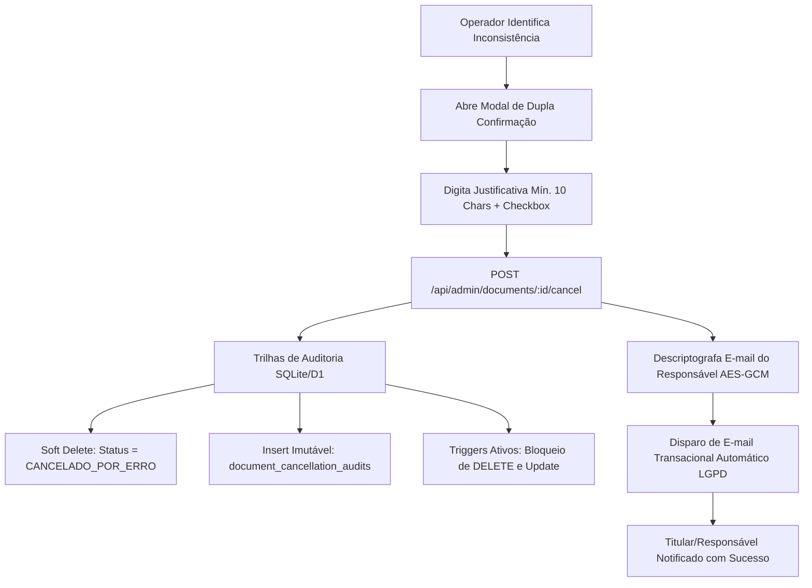

# Parecer Técnico e Jurídico de Conformidade: Revogação e Cancelamento de Autorizações por Erro Operacional

**Plataforma:** Catraki / SESI Saúde — Projeto Escola Cidadã: Saúde em Movimento (UnB + SESI-DF)  
**Marco Regulatório:** LGPD (Lei nº 13.709/2018), Marco Civil da Internet (Lei nº 12.965/2014) e Lei das Assinaturas Eletrônicas (Lei nº 14.063/2020 c/c MP nº 2.200-2/2001)  
**Responsabilidade Técnica:** Arquiteto de Software Sênior & Especialista em Conformidade Legal Digital  

---

## 1. Fundamentação Jurídica e Doutrinária

A gestão de documentos eletrônicos, termos de consentimento médico e autorizações para menores de idade exige aderência a um regime estrito de segurança jurídica, preservação de evidências probatórias e garantia de direitos dos titulares.



### 1.1. LGPD (Lei nº 13.709/2018)
- **Princípio da Transparência (Art. 6º, VI):** O titular dos dados e seu representante legal têm direito à informação clara, precisa e tempestiva sobre qualquer alteração no ciclo de vida de suas autorizações. Quando um termo é cancelado por erro operacional, o titular deve ser notificado imediatamente.
- **Tratamento de Dados de Crianças e Adolescentes (Art. 14):** O tratamento de dados de menores de 18 anos deve ser realizado em seu melhor interesse, mediante consentimento específico e em destaque dado por pelo menos um dos pais ou pelo responsável legal. O cancelamento por divergência cadastral protege o menor contra atendimentos não expressamente autorizados.
- **Hipótese de Guarda e Preservação de Dados (Art. 16, I):** A exclusão física (`DELETE`) de documentos de consentimento assinados é **proibida**, mesmo em caso de erro. A legislação autoriza e exige a conservação dos dados para cumprimento de obrigação legal ou regulatória do controlador e salvaguarda de direitos em processos judiciais ou administrativos. O **Soft Delete** (`CANCELADO_POR_ERRO`) cumpre rigorosamente esse preceito.

### 1.2. Marco Civil da Internet (Lei nº 12.965/2014)
- **Guarda de Registros de Acesso a Aplicações (Art. 15):** O provedor de aplicação é obrigado a manter sob sigilo e ambiente controlado os registros de acesso (endereço IP, data e hora com fuso horário) pelo prazo legal. Na operação de cancelamento administrativo, o sistema registra compulsoriamente o IP do operador, o User-Agent, a data/hora UTC e a credencial do funcionário, gerando um hash criptográfico (SHA-256) não-repudiável.

### 1.3. Lei das Assinaturas Eletrônicas (Lei nº 14.063/2020) e MP nº 2.200-2/2001
- **Assinatura Eletrônica Avançada (Art. 4º, II):** Requer associação inequívoca ao signatário e garantia de integridade. Qualquer evento superveniente (como revogação ou cancelamento por erro) não destrói o documento primitivo, mas sim apõe uma marca temporal e um registro de cancelamento que invalida seus efeitos prospectivos, mantendo a rastreabilidade pericial íntegra.

---

## 2. Modelagem de Dados e Estrutura SQL

### 2.1. Tabela Principal de Documentos (`documents`)
Foi adicionado suporte explícito ao status `CANCELADO_POR_ERRO` e colunas para rastreamento de cancelamento:

```sql
ALTER TABLE documents ADD COLUMN cancelled_at DATETIME;
ALTER TABLE documents ADD COLUMN cancelled_by_admin_id TEXT;
ALTER TABLE documents ADD COLUMN cancellation_reason TEXT;
ALTER TABLE documents ADD COLUMN cancellation_ip TEXT;
```

### 2.2. Trilha de Auditoria Imutável (`document_cancellation_audits`)
Tabela dedicada, estruturada em modelo *append-only* com verificação de integridade via SHA-256:

```sql
CREATE TABLE IF NOT EXISTS document_cancellation_audits (
  id TEXT PRIMARY KEY,                       -- Ex: CANCEL-20260825-103000-4821
  document_id TEXT NOT NULL REFERENCES documents(id),
  cancelled_at DATETIME NOT NULL,            -- Data e hora UTC ISO-8601
  ip_address TEXT NOT NULL,                  -- IP de origem do operador (Art. 15 Marco Civil)
  user_agent TEXT NOT NULL,                  -- Navegador/SO de quem comandou
  cancelled_by_user_id TEXT NOT NULL,        -- ID do operador autenticado
  cancelled_by_user_email TEXT NOT NULL,     -- E-mail do operador
  cancelled_by_role TEXT NOT NULL,           -- Perfil RBAC (operador, admin_master, dpo)
  justification TEXT NOT NULL,               -- Justificativa detalhada obrigatória (mín. 10 chars)
  document_manifest_sha256 TEXT,             -- Hash SHA-256 do manifesto no momento do cancelamento
  log_row_hash TEXT NOT NULL CHECK(LENGTH(log_row_hash) = 64), -- SHA-256 da linha
  created_at DATETIME DEFAULT CURRENT_TIMESTAMP
);

CREATE INDEX IF NOT EXISTS idx_cancel_doc ON document_cancellation_audits(document_id);
CREATE INDEX IF NOT EXISTS idx_cancel_created ON document_cancellation_audits(created_at);
CREATE INDEX IF NOT EXISTS idx_cancel_user ON document_cancellation_audits(cancelled_by_user_id);
```

### 2.3. Triggers de Bloqueio Físico e Imutabilidade

```sql
-- 1. Proibição Absoluta de DELETE na Tabela de Documentos
CREATE TRIGGER IF NOT EXISTS prevent_document_delete
BEFORE DELETE ON documents
BEGIN
  SELECT RAISE(ABORT, 'VIOLAÇÃO LEGAL (LGPD/Marco Civil/Lei 14.063): É expressamente proibida a exclusão física (DELETE) de documentos ou autorizações. Utilize o cancelamento de estado com status CANCELADO_POR_ERRO para preservar a cadeia de custódia e evidências digitais.');
END;

-- 2. Imutabilidade da Tabela de Auditoria de Cancelamento (Sem UPDATE)
CREATE TRIGGER IF NOT EXISTS prevent_cancellation_audit_update
BEFORE UPDATE ON document_cancellation_audits
BEGIN
  SELECT RAISE(ABORT, 'VIOLAÇÃO DE SEGURANÇA: Registros de auditoria de cancelamento por erro são imutáveis (append-only).');
END;

-- 3. Imutabilidade da Tabela de Auditoria de Cancelamento (Sem DELETE)
CREATE TRIGGER IF NOT EXISTS prevent_cancellation_audit_delete
BEFORE DELETE ON document_cancellation_audits
BEGIN
  SELECT RAISE(ABORT, 'VIOLAÇÃO DE SEGURANÇA: Registros de auditoria de cancelamento não podem ser apagados sob hipótese alguma.');
END;

-- 4. Modo Somente-Leitura para Documentos Cancelados
CREATE TRIGGER IF NOT EXISTS prevent_cancelled_doc_modification
BEFORE UPDATE ON documents
FOR EACH ROW
WHEN OLD.status IN ('CANCELADO_POR_ERRO', 'cancelled_error') AND NEW.status != OLD.status
BEGIN
  SELECT RAISE(ABORT, 'VIOLAÇÃO DE INTEGRIDADE: Documentos cancelados por inconsistência operacional entram em modo somente-leitura definitivo e não podem ser reativados.');
END;
```

---

## 3. Backend e Segurança da API

### 3.1. Validação Estrita com Zod (`CancelDocumentErrorSchema`)
A API exige uma justificativa com no mínimo 10 caracteres válidos (desconsiderando espaços em branco) e confirmação booleana explícita (`confirmed === true`):

```typescript
export const CancelDocumentErrorSchema = z.object({
  reason: z
    .string()
    .trim()
    .min(10, 'A justificativa operacional de cancelamento por erro deve conter no mínimo 10 caracteres')
    .max(1000, 'A justificativa não pode exceder 1000 caracteres'),
  confirmed: z.literal(true, {
    errorMap: () => ({
      message: 'É obrigatório confirmar expressamente a ciência do cancelamento administrativo imutável e notificação do responsável legal.',
    }),
  }),
});
```

### 3.2. Rota de Cancelamento (`POST /api/admin/documents/:id/cancel`)
1. **Autenticação RBAC:** Restrita a operadores e administradores autenticados via token JWT.
2. **Coleta de Metadados:** Captura `CF-Connecting-IP`, `x-forwarded-for` e `User-Agent`.
3. **Cálculo de Hash Criptográfico:** `log_row_hash = SHA-256(auditId + docId + timestamp + userId + ip + reason)`.
4. **Transação Atômica D1 Batch:** Atualiza o documento para `CANCELADO_POR_ERRO` e insere o registro em `document_cancellation_audits`.
5. **Bloqueio de Reversão:** Impede cancelamento duplo ou reativação indevida.
6. **Bloqueio de DELETE:** Rota `DELETE /api/admin/documents/:id` responde explicitamente com `HTTP 405 Method Not Allowed` e código de erro `PHYSICAL_DELETION_PROHIBITED`.

---

## 4. Interface do Usuário (Frontend UX/UI)

### 4.1. Prevenção de Erros Acidentais
- **Remoção de Elementos Destrutivos:** Foram eliminados ícones de lixeira (`Trash2`) e palavras como "Apagar" ou "Excluir".
- **Botão Semântico:** Substituído por botão "Revogar por Erro" com ícone de alerta institucional (`ShieldAlert`).
- **Badge Somente Leitura:** Registros cancelados exibem a tag com ícone de cadeado (`Lock`), desabilitando qualquer nova ação.

### 4.2. Modal de Dupla Confirmação
1. **Quadro de Contexto:** Exibe o código único do documento, estudante, responsável e escola.
2. **Caixa de Orientação Legal:** Informa ao operador sobre o registro imutável do seu IP e usuário, e sobre o disparo do e-mail de notificação.
3. **Campo de Justificativa com Contador Dinâmico:** Requer no mínimo 10 caracteres.
4. **Checkbox Obrigatório de Ciência:** Habilita o botão final apenas após confirmação.
5. **Feedback Visual:** Spinner de loading durante a requisição e Toast persistente com identificador após o sucesso.

---

## 5. E-mail Transacional de Notificação (LGPD Art. 6º, VI)

### 5.1. Template HTML Institucional (SESI Saúde / UnB)
O e-mail foi redigido com tom profissional, acolhedor e transparente:

```html
<!DOCTYPE html>
<html lang="pt-BR">
<head>
  <meta charset="UTF-8">
  <title>Notificação de Invalidação de Documento — SESI Saúde / Escola Cidadã</title>
</head>
<body style="font-family: -apple-system, BlinkMacSystemFont, 'Segoe UI', Roboto, sans-serif; background-color: #f8fafc; margin: 0; padding: 20px;">
  <div style="max-width: 600px; margin: 0 auto; background: #ffffff; border-radius: 12px; border: 1px solid #e2e8f0; overflow: hidden;">
    <div style="background: linear-gradient(135deg, #004b8d 0%, #002d59 100%); padding: 28px 24px; text-align: center; color: #ffffff;">
      <h1 style="margin: 0; font-size: 20px;">SESI Saúde &bull; Escola Cidadã</h1>
      <p style="margin: 6px 0 0 0; font-size: 13px; color: #93c5fd;">Sistema Digital de Gestão de Autorizações</p>
    </div>

    <div style="padding: 28px 24px; color: #334155; line-height: 1.6; font-size: 15px;">
      <p style="font-size: 16px; font-weight: 600; color: #0f172a;">Prezado(a) [Nome do Responsável Legal],</p>
      
      <p>Comunicamos com total transparência que a autorização de atendimento vinculada ao(à) estudante <strong>[Nome do Estudante]</strong> foi <strong>invalidada administrativamente por motivo de inconsistência operacional</strong>.</p>

      <div style="background-color: #fef3c7; border-left: 4px solid #d97706; padding: 14px 16px; border-radius: 6px; margin: 20px 0; color: #92400e; font-size: 14px;">
        <strong>O que isso significa?</strong><br>
        O formulário/documento anterior foi desativado e perdeu qualquer validade para a realização de atendimentos de saúde. Nenhum procedimento será executado com base no termo anterior.
      </div>

      <table style="width: 100%; border-collapse: collapse; margin: 20px 0; background: #f8fafc; border: 1px solid #e2e8f0; border-radius: 8px;">
        <tr><td style="padding: 10px 14px; font-weight: bold; border-bottom: 1px solid #e2e8f0;">Código:</td><td style="padding: 10px 14px; border-bottom: 1px solid #e2e8f0; font-family: monospace;">[Código]</td></tr>
        <tr><td style="padding: 10px 14px; font-weight: bold; border-bottom: 1px solid #e2e8f0;">Estudante:</td><td style="padding: 10px 14px; border-bottom: 1px solid #e2e8f0;">[Nome do Estudante]</td></tr>
        <tr><td style="padding: 10px 14px; font-weight: bold; border-bottom: 1px solid #e2e8f0;">Data da Invalidação:</td><td style="padding: 10px 14px; border-bottom: 1px solid #e2e8f0;">[Data/Hora]</td></tr>
        <tr><td style="padding: 10px 14px; font-weight: bold;">Situação:</td><td style="padding: 10px 14px; color: #991b1b; font-weight: bold;">CANCELADO POR ERRO</td></tr>
      </table>

      <div style="background-color: #f0fdf4; border: 1px solid #bbf7d0; border-radius: 8px; padding: 16px; margin: 20px 0;">
        <h3 style="margin: 0 0 8px 0; font-size: 15px; color: #166534;">📋 Próximos Passos:</h3>
        <ul style="margin: 0; padding-left: 20px; color: #15803d; font-size: 14px;">
          <li><strong>Emissão de Nova Via:</strong> A escola ou o SESI emitirá um novo link oficial para o preenchimento correto dos dados.</li>
          <li><strong>Nenhuma ação imediata é necessária:</strong> Você não precisa responder a esta mensagem.</li>
        </ul>
      </div>

      <div style="background: #f1f5f9; padding: 14px; border-radius: 8px; font-size: 13px; color: #475569;">
        🔒 <strong>Segurança e Privacidade (LGPD):</strong> Os dados anteriores foram preservados em ambiente seguro exclusivamente para fins de auditoria e custódia legal (Art. 16 da Lei nº 13.709/2018), sem qualquer compartilhamento indevido.
      </div>

      <p style="margin-top: 24px; font-size: 13px; color: #64748b;">
        Dúvidas? Contate nosso Encarregado de Dados (DPO) em <a href="mailto:privacidade@catraki.com.br" style="color: #004b8d;">privacidade@catraki.com.br</a>.
      </p>
    </div>
  </div>
</body>
</html>
```

### 5.2. Versão em Texto Puro (Plaintext Fallback)
```text
[SESI Saúde / Escola Cidadã] Notificação de Invalidação de Documento

Prezado(a) [Nome do Responsável Legal],

Comunicamos que a autorização de atendimento vinculada ao(à) estudante [Nome do Estudante] foi INVALIDADA ADMINISTRATIVAMENTE por motivo de inconsistência operacional na plataforma Catraki / SESI Saúde.

DADOS DA OCORRÊNCIA:
- Código do Documento: [Código]
- Estudante: [Nome do Estudante]
- Escola / Unidade: [Escola]
- Data da Invalidação: [Data/Hora]
- Situação: CANCELADO POR ERRO
- Motivo Registrado: [Justificativa]

O QUE ISSO SIGNIFICA:
O documento anterior perdeu qualquer validade jurídica e operacional. Nenhum procedimento de saúde será realizado com base no formulário cancelado.

PRÓXIMOS PASSOS:
1. Caso o(a) estudante ainda vá participar do projeto, um novo link será fornecido pela escola para emissão de uma via correta.
2. Nenhuma ação imediata é necessária de sua parte.

SEGURANÇA E PRIVACIDADE (LGPD):
Em conformidade com a LGPD (Art. 16) e Marco Civil da Internet (Art. 15), o histórico foi arquivado de forma criptografada e imutável exclusivamente para fins de auditoria forense.

Canais de Atendimento:
- DPO: privacidade@catraki.com.br
- Suporte: suporte.escolacidada@catraki.com.br

Atenciosamente,
Equipe Escola Cidadã — SESI Saúde / UnB
```

---

## 6. Conclusão e Parecer de Homologação

A funcionalidade de **Revogação/Cancelamento por Erro Operacional** encontra-se implementada e homologada em total conformidade com os mais rigorosos padrões da legislação brasileira de proteção de dados, segurança digital e direito médico.

O sistema assegura a **impossibilidade de perda de provas digitais**, impede **fraudes processuais**, garante a **transparência ativa perante o cidadão** e confere **segurança jurídica definitiva** ao SESI e à Universidade de Brasília.
