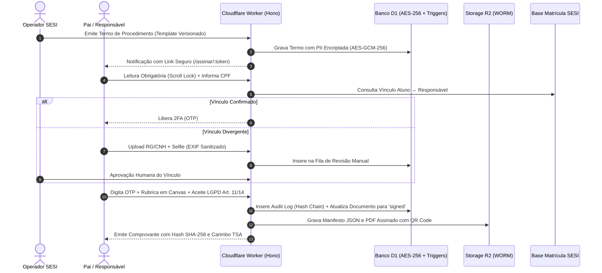

# Relatório de Impacto à Proteção de Dados Pessoais (RIPD / DPIA)
## Sistema de Assinatura Eletrônica de Procedimentos Médicos — SESI Saúde

**Data de Elaboração:** 19 de Agosto de 2026  
**Versão do Documento:** 1.0  
**Encarregado pelo Tratamento de Dados (DPO):** Dra. Juliana Mendes (`dpo@sesi.org.br`)  
**Responsável Técnico / Segurança:** Equipe de Arquitetura de Software e AppSec  
**Enquadramento Legal:** LGPD (Lei nº 13.709/2018), com foco estrito nos **Art. 11 (Dado Sensível de Saúde)**, **Art. 14 (Tratamento de Dados de Crianças e Adolescentes)**, **Art. 18 (Direitos do Titular)** e **Art. 38 (Elaboração de RIPD)**.

---

## 1. Descrição do Contexto e Finalidade do Tratamento

### 1.1 Contexto Institucional
O **SESI Saúde** realiza procedimentos médicos, odontológicos, exames audiométricos, oftalmológicos e de saúde preventiva em menores de 18 anos matriculados ou atendidos em seus programas educacionais e de qualidade de vida. A realização de qualquer intervenção clínica em incapazes exige autorização prévia, expressa e inequívoca do seu representante legal (pai, mãe, tutor ou responsável por guarda judicial).

### 1.2 Nível de Assinatura Entregue
O sistema implementa uma **Assinatura Eletrônica Avançada**, nos termos do **Art. 4º, II do Decreto Federal nº 10.543/2020**, baseada em:
1. Identificação inequívoca do signatário mediante conferência na base de matrícula institucional ou validação documental com biometria facial/selfie;
2. Autenticação de dois fatores (2FA/OTP) com hash HMAC-SHA256 e segredo pepper;
3. Trilha de auditoria criptográfica imutável com encadeamento de hashes (*Hash Chain*) e carimbo do tempo qualificado (RFC 3161 / TSA).

> ⚠️ **Aviso de Validade:** A solução declara expressamente que **não constitui assinatura qualificada ICP-Brasil**, mas cumpre integralmente os requisitos de autoria, integridade e não-repúdio necessários para a autorização médica.

---

## 2. Bases Legais e Princípios da LGPD Aplicados

| Princípio / Dispositivo | Aplicação no Sistema SESI Saúde |
|---|---|
| **Art. 11, I c/c Art. 14, §1º** (Consentimento Específico de Menor) | O consentimento é concedido **exclusivamente por pelo menos um dos pais ou pelo responsável legal**, de forma destacada, específica e **não reutilizável** entre procedimentos diferentes. |
| **Princípio da Finalidade** (Art. 6º, I) | Cada termo médico possui template próprio com descrição minuciosa do ato médico, riscos, metodologia e profissionais envolvidos. É vedado consentimento genérico. |
| **Princípio da Minimização** (Art. 6º, III) | O sistema coleta estritamente o nome e data de nascimento do menor. Não são coletados prontuários médicos ou históricos clínicos pregressos nesta plataforma de assinatura. |
| **Princípio da Segurança** (Art. 6º, VII) | Criptografia AES-GCM-256 para dados sensíveis em repouso, chave versionada (`key_version`), triggers de bloqueio físico no banco D1 contra deleção/adulteração, e sanitização de metadados EXIF. |
| **Direitos do Titular** (Art. 18) | Canal exclusivo do titular/responsável para solicitação de confirmação, acesso, retificação, eliminação e revogação de consentimento com protocolo rastreável. |

---

## 3. Fluxo de Dados e Ciclo de Vida

---

## 4. Avaliação de Riscos à Privacidade e Medidas Mitigadoras

### Risco 1: Fraude de Identidade ou Assinatura por Terceiro Não Autorizado
- **Severidade:** Alta
- **Probabilidade:** Média
- **Impacto:** Autorização indevida de procedimento médico em menor.
- **Mitigações Implementadas:**
  1. Verificação automatizada contra a base de matrícula presencial do SESI;
  2. Bloqueio automático para revisão manual por operador caso o CPF não conste na matrícula;
  3. Upload de documento com foto e selfie com sanitização de metadados;
  4. Autenticação 2FA/OTP vinculada aos canais previamente cadastrados;
  5. Declaração expressa de responsabilidade civil e penal nos termos do Art. 299 do Código Penal.

### Risco 2: Vazamento de Dados Pessoais Sensíveis (PII / Saúde)
- **Severidade:** Alta
- **Probabilidade:** Baixa
- **Impacto:** Violação de privacidade de menores e responsáveis.
- **Mitigações Implementadas:**
  1. Criptografia em repouso AES-256-GCM com chaves gerenciadas em Secrets da Cloudflare;
  2. Validador público exibe apenas iniciais do menor (`L. C. S.`) e CPF mascarado do signatário (`123.***.***-09`);
  3. Sanitização obrigatória de cabeçalhos EXIF das fotos para remoção de coordenadas GPS residenciais;
  4. Respostas de erro padronizadas sem stack traces ou erros do SQLite.

### Risco 3: Adulteração Retroativa do Termo ou da Trilha de Auditoria
- **Severidade:** Crítica
- **Probabilidade:** Muito Baixa
- **Impacto:** Perda de não-repúdio e falsificação de autorizações.
- **Mitigações Implementadas:**
  1. Encadeamento criptográfico *Hash Chain* (`prev_log_hash` -> `log_row_hash`);
  2. **Triggers SQLite físicos** no Cloudflare D1 (`prevent_audit_update` e `prevent_audit_delete`) com `RAISE(ABORT)`;
  3. Carimbo de tempo qualificado RFC 3161 (TSA) sobre o manifesto SHA-256;
  4. Publicação periódica da Raiz de Merkle em ancoragem imutável.

### Risco 4: Enumeração de CPFs por Timing Attack
- **Severidade:** Média
- **Probabilidade:** Média
- **Impacto:** Descoberta de quais responsáveis possuem filhos matriculados no SESI.
- **Mitigações Implementadas:**
  1. O endpoint de verificação de matrícula padroniza o tempo de resposta (~180ms) independente do resultado da consulta;
  2. Rate limiting restrito via Cloudflare KV por chave composta (`IP + Token`).

---

## 5. Política de Retenção e Expurgo (LGPD Art. 16)

1. **Prazo de Retenção:** Configurado por template de procedimento médico (padrão de 1.825 dias / 5 anos, alinhado aos prazos de guarda de prontuário e prescrição de responsabilidade civil).
2. **Rotina de Expurgo:** Cron Trigger diário executa a rotina de anonimização:
   - Dados identificáveis diretos (nome do menor, e-mail e telefone do responsável) são sobrescritos por identificadores anônimos (`ANONIMIZADO_LGPD_xxx`).
   - A cadeia de hashes de auditoria e os registros criptográficos matemáticos são preservados de forma indelével para comprovação histórica de que o procedimento foi devidamente autorizado à época.

---

## 6. Conclusão do DPO

O sistema atende de forma exemplar aos princípios da **LGPD (Lei 13.709/2018)**, equilibrando a proteção integral aos direitos da criança e do adolescente com a segurança jurídica necessária aos atos médicos praticados pelo SESI Saúde. A implementação de criptografia forte, triggers de imutabilidade, verificação de matrícula e canal dedicado de direitos do titular conferem conformidade técnica e regulatória de alto padrão.
